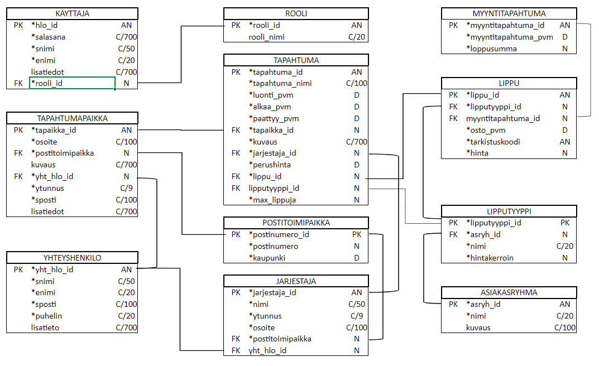

# TicketGuru - Lipputoimiston lippujärjestelmä

Tiimi 4: Golubev Artur, Huovinen Mia, Tuomela Jouni, Varpanen Hilda-Maija. 

## Johdanto

Asiakkaanamme toimii lipputoimisto, joka haluaa uudistaa lipunmyyntijärjestelmänsä vastaamaan nykypäivän vaatimuksia ja tarpeita. TicketGuru-järjestelmän tavoitteena on mahdollistaa lippujen myynti myyntipisteessä sekä myöhemmin myös verkkokaupassa. Lippujen myynti tapahtuu ensisijaisesti myyntipisteessä, jossa lipunmyyjä myy ja tulostaa liput asiakkaille. Kun ennakkomyynti päättyy, jäljellä jäävät liput tulostetaan myyntipisteen sijaan ovella myytäväksi. Jokaisessa lipussa on selkeästi tarkastettava koodi, joka mahdollistaa nopean ja vaivattoman pääsyn tapahtumaan.

Järjestelmä suunnitellaan ensisijaisesti käytettäväksi websovelluksena, joka on optimoitu käytettäväksi kannettavalla tai pöytäkoneella.

## Järjestelmän määrittely

### Käyttäjäryhmät

**Sovelluksen käyttäjäryhmät:**

1. **Lipunmyyjä:** Lipunmyyjä työskentelee lipputoimistossa ja vastaa lippujen myynnistä asiakkaille. Lipunmyyjät käyttävät järjestelmää lippujen myymiseen ja tulostamiseen.

2. **Lipuntarkastaja:** Lipuntarkastaja tarkistaa lipun aitouden tapahtuman sisäänkäynnillä. Lipuntarkastajat käyttävät järjestelmää lipun tarkistamiseen ja varmistavat, että vain oikeilla lipuilla henkilöt pääsevät tapahtumaan.

3. **Palveluntarjoaja:** Palveluntarjoaja käyttää järjestelmää tapahtumien lisäämiseen, hallinoimiseen ja seuraamiseen sekä lipunmyynnin tietojen tarkastelemiseen. Palveluntarjoaja saa toimeksiannot tapahtumien lisäämisestä ja myymisestä tapahtumajärjestäjiltä, keikkamyyjiltä sekä muilta organisaatioilta.

### Käyttötapauskaavio

## Käyttöliittymä

Käyttöliittymä on tarkoitus toteuttaa alustavasti Reactilla. Käyttöliittymäsivu aukeaa kirjautumissivulle, jonka kautta pääsee käyttäjän oikeuksien mukaiselle työpöydälle.

- Pääkäyttäjälle avautuu listaus tapahtumista nykyhetkestä eteenpäin ja valinnat mm. lisätä ja muokata tapahtumia.
- Myyjälle avautuu listaus tapahtumista nykyhetkestä eteenpäin ja mahdollisuus hakea ja myydä tapahtumia.
- Lipuntarkastajalle avautuu näkymä lippujen tarkastukseen ja myyntiin jo tulostetuille lipuille.

## Tietokanta

Kappaleessa kuvataan järjestelmässä käytettävän tietokannan rakennetta. Tietohkemisto-kuvaukset auttavat käytettävien attribuuttien ymmärtämisessä, sekä taulujen yhteyksien hahmottamisessa. Jokaisesta taulusta on annettu tarkat kuvaukset, jotka sisältävät taulun kentät, niiden tyypit ja niiden tarkoitukset. Tämä osio tarjoaa kattavan yleiskuvan tietokannan rakenteesta, tietokantakaaviosta ja toiminnallisuudesta.

> ### _Jarjestaja_
> _Jarjestaja-taulu sisältää tiedot tapahtuman organisoivasta tahosta, eli tapahtuman järjestäjästä. Tapahtumalla on yksi järjestäjä, mutta järjestäjällä voi olla monta tapahtumaa. Järjestäjä liittyy Yhteyshenkilo-, Tapahtuma- ja Postitoimipaikka -tauluihin. Järjestäjällä voi olla monta yhteyhenkilöä ja vain yksi postitoimipaikka._
> 
> Kenttä | Tyyppi | Kuvaus
> ------ | ------ | ------
> jarjestaja_id | int PK | Järjestäjän yksilöivä tunniste
> nimi | varhcar(50) | Järjestäjän nimi
> ytunnus | varchar(9) | Järjestävän yrityksen y-tunnus
> osoite | varchar (100) | Järjestäjän osoite
> postitoimipaikka_id | int | Osoitteen oikeaan alueeseen liittävä identifioiva tunnus, viittaus [postoimipaikka](#Postitoimipaikka)-tauluun
> yht_hlo_id | int FK |Järjestäjän yhteyshenkilö, viittaus [yhteyshenkilo](#Yhteyshenkilo)-tauluun
>
>
> ### _Kayttaja_
> _Kayttaja-taulu sisältää käyttäjien kirjautumistiedot ja yhdellä käyttäjällä voi olla vain yksi rooli._
>
> Kenttä | Tyyppi | Kuvaus
> ------ | ------ | ------
> hlo_id | INT PK | Käyttäjän ID
> salasana | VARCHAR(700) | Käyttäjän salasana
> snimi | VARCHAR(50) | Käyttäjän sukunimi
> enimi | VARCHAR(20) | Käyttäjän etunimi
> lisatiedot | VARCHAR(700) | Mahdollisia lisätietoja käyttäjästä
> rooli_id | INT FK | Viittaus käyttäjän rooliin [rooli](#Rooli)-tauluun
>
>
> ### _Postitoimipaikka_
> _Postitoimipaikka-taulu, sisältää tiedot postinumerosta sekä kapungista, johon määrätty postinumero liittyy. Postinumeron avulla saman nimiset osoitteet erotetaan toisistaan ja sijoitetaan oikeisiin kuntiin tai kaupunkeihin. Postinumerolla voi olla monta osoitetta, mutta vain yksi kaupunki tai kunta. Postitoimipaikka liittyy Jarjestaja-tauluun ja Tapahtumapaikka-tauluun._
>
> Kenttä | Tyyppi | Kuvaus
> ------ | ------ | ------
> postinumeroId | int PK | Postitoimipaikan yksilöivä tunnus
> postinumero | int | Postitoimipaikan postinumero
> kaupunki | varchar (50) | Paikkakunta, johon postinumero liittää osoitteen
> 
> 
> ### _Rooli_
> _Rooli-taulu sisältää roolin, joka määrittää käyttäjän oikeudet käyttöliittymän kautta tehtäviin hakuihin ja muutoksiin_
> 
> Kenttä | Tyyppi | Kuvaus
> ------ | ------ | ------
> rooli_id | INT PK | Roolin ID
> rooli_nimi | VARCHAR(20) | Roolin nimi
>
>
> ### _Tapahtuma_
> _Tapahtuma-taulu sisältää tapahtumat. Tapahtumalla on yksi tapahtumapaikka ja yksi järjestäjä. Tapahtumapaikalla ja järjestäjällä voi olla monta tapahtumaa._
>
> Kenttä | Tyyppi | Kuvaus
> ------ | ------ | ------
> tapahtuma_id | int PK | Tapahtuman yksilöllinen tunniste
> tapahtuma_nimi | varchar(100) | Tapahtuman nimi
> luonti_pvm | timestamp with zone | Tapahtuman  UTC-luontipäivämäärä
> alkaa_pvm | timestamp with zone | UTC-tiedon sisältävä tapahtuman alkamispäivä ja kellonaika
> paattyy_pvm | timestamp with zone | UTC-tiedon sisältävä tapahtuman päättymispäivä ja kellonaika
> tapaikka_id | int FK | Tapahtuman järjestämispaikka, viittaus [tapahtumapaikka](#Tapahtumapaikka)-tauluun
> kuvaus | varchar(700) | Kuvaus tapahtumasta
> jarjestaja_id | int FK | Tapahtuman järjestäjä, viittaus [jarjestaja](#Jarjestaja)-tauluun
> perushinta | decimal | Tapahtumalipun perushinta, kiinteä liukuluku
> lippu_id | int FK | Tapahtuman lippu, viittaus [lippu](#lippu)-tauluun
> lipputyyppi_id | int FK | Lipputyyppi, viittaa [lipputyyppi](#lipputyyppi)-tauluun
> max_lippuja | int | Tapahtuman myytävien lippujen maksimimäärä
>
>
> ### _Tapahtumapaikka_
> _Tapahtumapaikka-taulu sisältää tiedot paikasta, jossa tapahtuma järjestetään. Tapahtumalla on yksi tapahtumapaikka, tapahtumapaikalla voi olla monta tapahtumaa. Tapahtumalla on yksi postinumero ja yhteyshenkilö. Postinumerolla voi olla useita tapahtumapaikkoja. Yhteyshenkilöllä on vain yksi tapahtumapaikka._
>
> Kenttä | Tyyppi | Kuvaus
> ------ | ------ | ------
> tapaikka_id | int PK | Tapahtumapaikan yksillöllinen tunniste
> osoite | varchar(100) | Tapahtumapaikan osoite
> postinro | int FK | Tapahtumapaikan postitoimipaikka, viittaus [postitoimipaikka](#Postitoimipaikka)-tauluun
> kuvaus | varchar(700) | Kuvaus tapahtumapaikasta
> yht_hlo_id | int FK | Tapahtumapaikan yhteyshenkilö, viittaus [yhteyshenkilo](#Yhteyshenkilo)-tauluun
> ytunnus | char(9) | Tapahtumapaikan y-tunnus
> sposti | varchar(100) | Tapahtumapaikan sähköpostiosoite markkinointitarkoituksiin
> lisatiedot | varchar(700) | Lisätietoja tapahtumapaikasta
>
>
> ### _Yhteyshenkilo_
> _Yhteyshenkilo-taulu sisältää tiedot henkilöstä, joka edustaa tapahtumapaikkaa. Yhteyshenkilö on taho johon järjestäjä voi olla tarvittaessa yhteydessä. Yhteyshenkilöllä on vain yksi tapahtumapaikka. Yhteyshenkilö voi olla yhteydessä moneen järjestäjään_
>
> Kenttä | Tyyppi | Kuvaus
> ------ | ------ | ------
> yht_hlo_id | int PK | Yhteyshenkilön yksilöivä tunniste
> sukunimi | varchar (50) | Yhteyshenkilön sukunimi
> etunimi | varchar (20) | Yhteyshenkilön etunimi
> sahkoposti | varchar (100) | Yhteyshenkilön sähköpostiosoite
> puhelin | varchar (20) | Yhteyshenkilön puhelinnumero
> lisatieto | varchar (700) | Yleisiä muistiinpanoja liittyen yhteyshenkilöön
> jarjestaja_id | int FK | Tapahtuman järjestäjä, viittaus [jarjestaja](#Jarjestaja)-tauluun
> tapaikka_id | int FK | Tapahtuman järjestämispaikka, viittaus [tapahtumapaikka](#Tapahtumapaikka)-tauluun
>
>
>### _Lippu_
>_Lippu-taulu tallentaa tiedot tapahtuman myydyistä lipuista. Jokaisella lipulla on oma yksilöinen tunniste ja se liittyy yhteen tapahtumaan ja asiakkaaseen. Lisäksi lipulla on lipputyyppi (esim. normaali, opiskelija, eläkeläinen) mikä määrittää sen hinnan ja ominaisuudet._
>
> Kenttä | Tyyppi | Kuvaus
> ------ | ------ | ------
> lippu_id | int PK | Lipun yksilöivä tunniste
> lipputyyppi_id | int FK | Lipputyypin tunniste, viittaus [lipputyyppi](#lipputyyppi)-tauluun
> myyntitapahtuma_id | int FK | Lippuun liittyvän myyntitapahtuman yksilöivä tunniste [myyntitapahtuma](#myyntitapahtuma)-tauluun
> osto_pvm | date | Lipun ostoajankohta
> kaytto_pvm | date | Lipun käyttöpäivämäärä, kun se on käytetty
> tarkistuskoodi | int | Lipun tarkistuskoodi, onko lippu käytetty vai ei
>
>
>### _Lipputyyppi_
>_Lipputyyppi-taulu sisäkltää erilaisia lipputyyppejä, jotka voivat vaihdella esimerkiksi hinnoittelun, pääsyoikeuksien tai muiden ominasuuksien suhteen. Jokaisella lipputyypillä on oma yksilöllinen tunniste ja se määrittelee lipun hinnan ja erikoisoikeudet._
>
> Kenttä | Tyyppi | Kuvaus
> ------ | ------ | ------
> lipputyyppi_id | int PK | Lipputyypin yksilöivä tunniste
> asryh_id | int FK | Lipputyypin asiakasryhmä, viittaus [asiakasryhmä](#asiakasryhmä)-tauluun
> nimi | varchar (20) | Lipun ostoajankohta
> hintamuutos | decimal | Mahdollinen hintamuutos verrattuna perushintaan, esim. alennusprosentti
>
>
>### _Asiakasryhmä_
>_Asiakasryhmä-taulu sisältää erilaisia asiakasryhmiä, jotka voivat saada erikoishintoja tai muita etuja. Tämä mahdollistaa segmentoinnin asiakkaiden välillä ja erilaisten tarjousten tekemisen eri ryhmille._
>
> Kenttä | Tyyppi | Kuvaus
> ------ | ------ | ------
> asryh_id | int PK | Asiakasryhmän yksilöivä tunniste
> nimi | varchar (20) | Asiakasryhmän nimi
> kuvaus | varchar (100) | Lyhyt kuvaus asiakasryhmästä ja sen erityisoikeuksista
> tarkista | boolean | Kenttä, joka määrittää, onko asiakasryhmä tarkistettava
>
>
>### _Myyntitapahtuma_
>_Myyntitapahtuma-taulu sisältää tiedot suoritetuista myyntitapahtumista. Myyntitapahtuma on toimi, jossa asiakas ostaa lippuja. Myyntitapahtumassa näkyvät tiedot ovat myyntitapahtuman ajankohta, ostettujen lippujen kokonaissumma sekä yksityikohdat jokaisesta ostetusta lipusta. Myyntitapahtuma liittyy Lippu-tauluun. Myyntitapahtuma luodaan sekä dto- että service-luokkien avulla._
>
> Kenttä | Tyyppi | Kuvaus
> ------ | ------ | ------
> myyntitapahtumaId | int PK | Myyntitapahtuman yksilöivä tunniste
> myyntitapahtumaPvm | date | Myyntitapahtuman päivämäärä
> loppusumma | decimal | Myyntitapahtumassa ostettujen lippujen yhteissumma
>
>
## Tekninen kuvaus

### REST-rajapinnan ratkaisut
Tapahtuma-luokan metodit on luotu REST-rajapinnalla. Ensimmäisessä vaihessa Tapahtuma-luokalle luotiin GET- , POST- , PUT- sekä DELETE-metodit.
Rajapinnan nimeämiskäytännössä käytettiin apuna GitHub-käyttäjä _jamecook:n_ kokoamaa ohjetta REST-rajapintojen dokumentaatiosta. Tämän jälkeen kaikille luoduille controller-luokille on luotu samat CRUD-metodit.

Projektin alkuvaiheessa kehitystyötä tehtiin vain lokaalisti osoitteessa http://localhost:8080.
Ensimmäisen vaiheen julkaisu tehtiin CSC:n Rahti-ympäristössä. Rahti pyrkii simuloimaan tuotanoympäristön kaltaista ympäristöä. Julkaisun jälkeen tuottetta on voinut käyttää myös osoitteessa https://projekti-ticketguru-tiimi4.rahtiapp.fi/.

Tulevaisuudessa kun tuote etenee tuotantovaiheeseen kannattaa Base-URL:n muuttaa vielä yksinkertaisempaan muotoon, esim. https://ticketguru.fi.

#### Endpoint Jarjestaja-luokalla on muotoa: /jarjestajat

Method: `GET`

- URL: "/jarjestajat". Hakee kaikki järjestelmän tapahtumajärjestäjät.
- URL: "/jarjestajat/{id}". Hakee valitun id:n mukaisen tapahtumajärjestäjän tiedot.

[Tarkempi kuvaus GET-pyynnöistä](restapidocs/jarjestajat/get.md)

Method: `POST`

- URL: "/jarjestajat". Luo uuden järjestäjän ja siihen liittyvät yhteyshenkilöt. Palauttaa tallennetun järjestäjän ja yhteyshenkiöiden tiedot. 

[Tarkempi kuvaus POST-pyynnöistä](restapidocs/jarjestajat/post.md)

Method: `PUT`

- URL: "/jarjestajat/{id}". Muokkaa olemassa olevan id:n mukaisen järjestäjän tietoja. Palauttaa tallennetut järjestäjän ja yhteyshenkilöiden tiedot. 

[Tarkempi kuvaus PUT-pyynnöistä](restapidocs/jarjestajat/put.md)

Method: `DELETE`

- URL: "/jarjestajat/{id}". Poistaa id:n mukaisen jarjestajan tiedot pysyvästi.

[Tarkempi kuvaus DELETE-pyynnöistä](restapidocs/jarjestajat/delete.md)

#### Endpoint Tapahtuma-luokalla on muotoa: /tapahtumat

Method: `GET`

- URL: "/tapahtumat". Hakee kaikki järjestelmän tapahtumien tiedot. Palauttaa listan kaikista tapahtumista.
- URL: "/tapahtumat/{id}". Hakee yhden tapahtuman tiedot tapahtuman id:n perusteella. Palauttaa valitun tapahtuman.

[Tarkempi kuvaus GET-pyynnöistä](restapidocs/tapahtumat/get.md)

Method: `POST`

- URL: "/tapahtumat". Luo uuden tapahtuman. Palauttaa luodun tapahtuman.

[Tarkempi kuvaus POST-pyynnöstä](restapidocs/tapahtumat/post.md)

Method: `PUT`

- URL: "/tapahtumat/{id}". Hakee tapahtuman id:n perusteella ja tallentaa tehdyt muutokset. Palauttaa muokatun tapahtuman.

[Tarkempi kuvaus PUT-pyynnöstä](restapidocs/tapahtumat/put.md)

Method: `DELETE`

- URL: "/tapahtumat/{id}". Hakee tapahtuman id:n perusteella ja poistaa tapahtuman. Palauttaa listan kaikista jäljellä olevista tapahtumista.

[Tarkempi kuvaus DELETE-pyynnöstä](restapidocs/tapahtumat/delete.md)

#### Endpoint Myyntitapahtuma-luokalla on muotoa: /myyntitapahtumat

Method: `GET`

- URL: "/myyntitapahtumat". Hakee kaikki järjestelmän myyntitapahtumat.
- URL: "/myyntitapahtumat/{id}". Hakee valitun id:n mukaisen myyntitapahtuman järjestelmästä.

[Tarkempi kuvaus GET-pyynnöistä](restapidocs/myynitapahtumat/get.md)

Method: `POST`

- URL: "/myyntitapahtumat". Luo uuden myyntitapahtuman. Palauttaa myyntipäivämäärän, loppusumman sekä listan lipuista.

[Tarkempi kuvaus POST-pyynnöstä](restapidocs/myynitapahtumat/post.md)

Method: `DELETE`

- URL: "/myyntitapahtumat/{id}". Poistaa  myyntitapahtuman, jos lippuja ei ole käytetty. 

[Tarkempi kuvaus DELETE-pyynnöstä](restapidocs/myynitapahtumat/delete.md)

#### Endpoint Kayttaja-luokalla on muotoa: /kayttajat

Method: `GET`

- URL: "/kayttajat". Hakee kaikki järjestelmän käyttäjät.
- URL: "/kayttajat/{id}". Hakee valitun id:n mukaisen käyttäjän.

[Tarkempi kuvaus GET-pyynnöistä](restapidocs/kayttajat/get.md)

Method: `POST`

- URL: "/kayttajat". Luo uuden käyttäjän. Palauttaa id:n, nimen ja tyhjän listan käyttäjistä.

[Tarkempi kuvaus POST-pyynnöistä](restapidocs/kayttajat/post.md)

Method: `PUT`

- URL: "/kayttajat/{id}". Muokkaa olemassa olevan id:n mukaisen käyttäjän tietoja.

[Tarkempi kuvaus PUT-pyynnöistä](restapidocs/kayttajat/put.md)

Method: `DELETE`

- URL: "/kayttajat/{id}". Poistaa id:n mukaisen käyttäjän tiedot pysyvästi.

[Tarkempi kuvaus DELETE-pyynnöistä](restapidocs/kayttajat/delete.md)

#### Endpoint Rooli-luokalla on muotoa: /roolit

Method: `GET`

 - URL: "/roolit". Hakee kaikki järjestelmän roolit.
 - URL: "/roolit/{id}". Hakee valitun id:n mukaisen roolin.

 [Tarkempi kuvaus GET-pyynnöistä](restapidocs/roolit/get.md)

Method: `POST`

 - URL: "/roolit". Luo uuden roolin. Palauttaa id:n, nimen ja listauksen käyttäjistä jotka operoivat valitulla roolilla.

 [Tarkempi kuvaus POST-pyynnöistä](restapidocs/roolit/post.md)

Method: `PUT`
 
 - URL: "/roolit/{id}". Muokkaa olemassa olevan id:n mukaisen roolin tietoja.

 [Tarkempi kuvaus PUT-pyynnöistä](restapidocs/roolit/put.md)

Method: `DELETE`

 - URL: "/roolit/{id}". Poistaa id:n mukaisen roolin tiedot pysyvästi.

[Tarkempi kuvaus DELETE-pyynnöistä](restapidocs/roolit/delete.md)

#### Endpoint Yhteyshenkilo-luokalla on muotoa: /yhteyshenkilot

Method: `GET`

- URL: "/yhteyshenkilot". Hakee kaikki järjestelmän yhteyshenkilöt.
- URL: "/yhteyshenkilot/{id}". Hakee valitun id:n mukaisen yhteyshenkilön tiedot.

[Tarkempi kuvaus GET-pyynnöistä](restapidocs/yhteyshenkilot/get.md)

Method: `POST`

- URL: "/yhteyshenkilot". Luo uuden yhteyshenkilön ja liittää sen tapahtumapaikan tai järjestäjän yhteyshenkilöksi. Palauttaa tallennetun yhteyshenkilön tiedot. 

[Tarkempi kuvaus POST-pyynnöistä](restapidocs/yhteyshenkilot/post.md)

Method: `PUT`

- URL: "/yhteyshenkilot/{id}". Muokkaa olemassa olevan id:n mukaisen yhteyshenkilön tietoja. Palauttaa tallennetun yhteyshenkilön tiedot. 

[Tarkempi kuvaus PUT-pyynnöistä](restapidocs/yhteyshenkilot/put.md)

Method: `DELETE`

- URL: "/yhteyshenkilot/{id}". Poistaa id:n mukaisen yhteyshenkilön tiedot pysyvästi.

[Tarkempi kuvaus DELETE-pyynnöistä](restapidocs/yhteyshenkilot/delete.md)

#### Endpoint Lippu-luokalla on muotoa: /lippu

Method: `GET`

- URL: "/lippu". Hakee kaikki järjestelmän liput.
- URL: "/lippu/{id}". Hakee valitun id:n mukaisen lipun tiedot.
- URL: "/liput?tarkistuskoodi=TARKISTUSKOODI". Tarkistetaan lippu tarkistuskoodilla

[Tarkempi kuvaus GET-pyynnöistä,](restapidocs/liput/get.md)
[ GET-Tarkistuskoodi](restapidocs/liput/getTarkistuskoodi.md)

Method: `POST`

- URL: "/lippu". Luo uuden lipun ja liittää sen tapahtumaan. Palauttaa tallennetun lipun tiedot.

[Tarkempi kuvaus POST-pyynnöistä,](restapidocs/liput/post.md)

Method: `DELETE`

- URL: "/lippu/{id}". Poistaa id:n mukaisen lipun tiedot pysyvästi.

[Tarkempi kuvaus DELETE-pyynnöistä](restapidocs/liput/delete.md)

#### Endpoint Lipputyyppi-luokalla on muotoa: /lipputyyppi

Method: `GET`

- URL: "/lipputyyppi". Hakee kaikki järjestelmän lipputyypit.
- URL: "/lipputyyppi/{id}". Hakee valitun id:n mukaisen lipputyypin tiedot.

[Tarkempi kuvaus GET-pyynnöistä,](restapidocs/lipputyypit/get.md)

Method: `POST`

- URL: "/lipputyyppi". Luo uuden lipputyypin ja palauttaa tallennetun lipputyypin tiedot.

[Tarkempi kuvaus POST-pyynnöistä,](restapidocs/lipputyypit/post.md)

Method: `PUT`

- URL: "/lipputyyppi/{id}". Hakee lipputyypin id:n perusteella ja tallentaa tehdyt muutokset. Palauttaa muokatun lipputyypin.

[Tarkempi kuvaus PUT-pyynnöistä,](restapidocs/lipputyypit/put.md)

Method: `DELETE`

- URL: "/lipputyyppi/{id}". Poistaa id:n mukaisen lipputyypin tiedot pysyvästi.

[Tarkempi kuvaus DELETE-pyynnöistä](restapidocs/lipputyypit/delete.md)

## Testaus

Ohjelmistolle on tehty yksikkötestejä sekä integraatiotestejä Junitilla. Ohjelmisto on testattu myös Robot Frameworkilla, jolla tehtiin End-to-End-testausta. Tarkempi kuvaus testeistä, testisuunnitelmista ja -tulokista löytyy Testidokumentaatiosta.

[Testausdokumentti](restapidocs/testit/ticketguru_testit.md)

Järjestelmässä on tällä hetkellä yksi ongelma, jota ei ole korjattu. Back-endiin kirjauduttaessa ohjelma ei siirrä käyttäjää suoraan sisäänkirjauksesta eteenpäin, vaan jää kirjautumissivulle White Label -tilaan.

## Asennustiedot

Tässä kappaleessa esitellään miten ohjelman voi ottaa käyttöön kehitysympäristössä sekä tuotantoympäristössä.

Suurin ero kehitysympäristön ja tuotantoympäristön välillä on tiedon pysyvyys. Kehitysympäristössä tieto katoaa heti, kun lokaali sovellus sammutetaan. Tuotantoympäristössä käytetään pysyvää tietokantaa tietokantapalvelimella, joka mahdollistaa persistentin tiedon käsittelyn. Näin pystytään jäljittelemään oikeaa tuotantoympäristöä, ja tuoteen testaamisesta voidaan suorittaa monipuolisemmin.

**Järjestelmän kehitysympäristön siirtäminen toiselle koneelle:**

-   Ohjelmointiympäristön asentaminen (esim. Visual Studio Code tai Eclipse)
-   MariaDB:n asentaminen valitulle serverille. Halutessaan voi käyttää myös väliaikaista H2-tietokantaa, jonne ei tallennu pysyvästi mitään tietoa. H2 soveltuu paikalliseen kehitykseen projektin alkuvaiheessa.
-   GitHub-repositorion kloonaaminen osoitteesta https://github.com/goluart/Projekti/tree/main
-   Varmista, että kehitysympäristössä on käytössä Java-17. Uudemmat versiot saattavat myös toimia, mutta tästä ei ole takeita.
-   Kehitysympäristössä on käytetty Spring Bootin versiota 3.2.3. Kuten edellä uudemmat versiot voivat myös toimia, mutta tästä ei ole takeita.
-   Jos käytössä on pysyvä tietokanta, varmista, että tietokanta on käynnissä. Käynnistä myös Spring Boot sovellus ohjelmointiympäristöstä. H2-tietokantaa käytettäessä, täytyy pitää huoli, että projektiin on asennettu oikeat riippuvuudet pom.xml-tiedostoon, sekä oikeat asetukset dokumentaatiosta löytyvään application.properties -tiedostoon.

**Järjestelmän siirtäminen tuotantoympäristöön**

-   Pysyvän tietokantapalvelun julkaisu vaatii palvelimen, jolle tietokantapalvelu voidaan asentaa Tämä lippujärjestelmä käyttää MariaDB-tietokantapalvelua. Palvelinympäristö on tuettava Javaa, joten siellä on oltava asennettuna Java Developement Kit.
-   Luotavalle MariaDB-tietokannalle pitää luoda:
    - Nimi
    - Käyttäjätunnus SQL-palvelimelle kirjautumista varten
    - Salasana käyttäjätunnusta varten
    - Tietokannan nimi
-   Spring Boot -palvelimen julkaisu Dockerfilen avulla. Toimiva Dockerfile löytyy projektista
-   GitHub-repositorion sisältämän koodin siirtäminen palvelimelle
-   Buidin käynnistäminen
-   Buildin automatisointi. Aina kun päivitetty koodi siirtyy GitHubin palvelin ottaa päivitetyn koodin käyttöön eikä uutta buildia tarvitse käynnistää manuaalisesti
-   Turvatun HTTPS-yhteyden konfigurointi
-   CORS-kofiguraatio. Salli valitut yhteydet WebSecurityConfig.java -tiedostossa, jotta Clientin yhteys Spring Boot -sovellukseen onnistuu.

## Käynnistys- ja käyttöohje

Ohjelmiston client-toteutus käynnistyy osoitteessa https://goluart.github.io/Projekti/. Käynnistys ei vaadi erityisiä toimenpiteitä, mutta ohjelma vaatii kirjautumisen.

Client pitää sisällään lipun myymisen tapahtumaan, lipun haun tarkistuskoodin perusteella, sekä lipun tarkistamisen.
Lipun haku tarkistuskoodin perusteella palauttaa tapahtuman nimen, tapahtumapaikan sekä lipputyypin.

Lipun tarkistuksessa pitää syöttää Tapahtuman nimi ja lipun tarkistuskoodi. Tämän jälkeen järjestelmä merkkaa lipun käytetyksi ja ilmoittaa siitä sivulla.

Tällä hetkellä QR-koodin generointia ei ole luotu projektiin. Mutta halutessaan sen voi luoda front-endissa, niin että yksilöllisen lipuntarkistuskoodin perusteella luodaan QR-koodi, jonka lipuntarkastaja voi lukea. QR-koodi palauttaa tapahtuman nimen, tapahtumapaikan sekä lipputyypin.

Ohjelmiston back-endin REST API löytyy osoitteesta https://projekti-ticketguru-tiimi4.rahtiapp.fi/login. Kun kirjautuminen on suoritettu, voi osoiterivillä siirtyä valitsemaansa end-pointiin, esim. https://projekti-ticketguru-tiimi4.rahtiapp.fi/tapahtumat.

Tällä hetkellä kirjautumistiedot on luotu seuraaville käyttäjille sekä back-endiin, että clientiin.

### Hallinto
-   **Käyttäjätunnus**: hallinto
-   **Salasana**: hallinto
-   **Muuta**: Kaikki oikeudet

### Myyjä
-   **Käyttäjätunnus**: myyja
-   **Salasana**: myyja
-   **Muuta**: Oikeudet lipun myyntiin

### Lipuntarkastaja
-   **Käyttäjätunnus**: lipuntarkastaja
-   **Salasana**: lipuntarkastaja
-   **Muuta**: Oikeudet lipun tarkastamiseen
