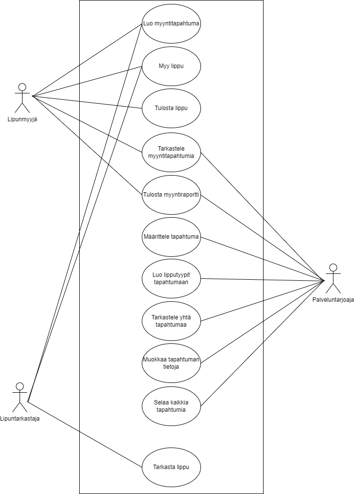

# TicketGuru - Lipputoimiston lippujärjestelmä

Tiimi 4: Golubev Artur, Huovinen Mia, Tuomela Jouni, Varpanen Hilda-Maija. 

## Johdanto

Asiakkaanamme toimii lipputoimisto, joka haluaa uudistaa lippujärjestelmänsä vastaamaan nykypäivän vaatimuksia ja tarpeita. TicketGuru-järjestelmän tavoitteena on mahdollistaa lippujen myynti myyntipisteessä sekä myöhemmin myös verkkokaupassa. Lippujen myynti tapahtuu ensisijaisesti myyntipisteessä, jossa lipunmyyjä myy ja tulostaa liput asiakkaille. Kun ennakkomyynti päättyy, jäljellä jäävät liput tulostetaan myyntipisteen sijaan ovella myytäväksi. Jokaisessa lipussa on selkeästi tarkastettava koodi, joka mahdollistaa nopean ja vaivattoman pääsyn tapahtumaan.

Järjestelmä suunnitellaan ensisijaisesti käytettäväksi websovelluksena, joka on optimoitu käytettäväksi läppärillä tai pöytäkoneella.

## Järjestelmän määrittely

### Käyttäjäryhmät

**Sovelluksen käyttäjäryhmät:**

1. **Lipunmyyjä:** Lipunmyyjä työskentelee lipputoimistossa ja vastaa lippujen myynnistä asiakkaille. Lipunmyyjät käyttävät järjestelmää lippujen myymiseen ja tulostamiseen.

2. **Lipuntarkastaja:** Lipuntarkastaja tarkistaa lipun aitouden tapahtuman sisäänkäynnillä. Lipuntarkastajat käyttävät järjestelmää lipun tarkistamiseen ja varmistavat, että vain oikeilla lipuilla henkilöt pääsevät tapahtumaan.

3. **Palveluntarjoaja:** Palveluntarjoaja käyttää järjestelmää tapahtumien lisäämiseen, hallinoimiseen ja seuraamiseen sekä lipunmyynnin tietojen tarkastelemiseen. Palveluntarjoaja saa toimeksiannot tapahtumien lisäämisestä ja myymisestä tapahtumajärjestäjiltä, keikkamyyjiltä sekä muilta organisaatioilta.

### Käyttötapauskaavio

-   Käyttäjäroolit ja roolien tarvitsemat toiminnot, esim. käyttötapauskaaviona
    (use case diagram) tai käyttäjätarinoina.

    

## Käyttöliittymä

Käyttöliittymä tarkoitus toteuttaa alustavasti Reactilla. Käyttöliittymäsivu aukeaa kirjautumissivulle, jonka kautta pääsee käyttäjän oikeuksien mukaiselle työpöydälle.

- Pääkäyttäjälle avautuu listaus tapahtumista nykyhetkestä eteenpäin ja valinnat mm. lisätä ja muokata tapahtumia.
- Myyjälle avautuu listaus tapahtumista nykyhetkestä eteenpäin ja mahdollisuus hakea ja myydä tapahtumia.
- Lipuntarkastajalle avautuu näkymä lippujen tarkastukseen ja myyntiin jo tulostetuille lipuille.

## Tietokanta

> ### _Kayttaja_
> _Kayttaja-taulu sisältää käyttäjien kirjautumistiedot ja yhdellä käyttäjällä voi olla vain yksi käyttäjä._
>
> Kenttä | Tyyppi | Kuvaus
> ------ | ------ | ------
> hlo_id | INT PK | Käyttäjän ID
> salasana | VARCHAR(700) | Käyttäjän salasana
> snimi | VARCHAR(50) | Käyttäjän sukunimi
> enimi | VARCHAR(20) | Käyttäjän etunimi
> lisatiedot | VARCHAR(700) | Mahdollisia lisätietoja käyttäjästä
> rooli_id | INT FK | Viittaus käyttäjän rooliin rooli-taulussa
>
>
> ### _Rooli_
> _Rooli-taulu sisältää roolin, joka määrittää käyttäjän oikeudet käyttöliittymän kautta tehtäviin hakuihin ja muutoksiin_
> 
> Kenttä | Tyyppi | Kuvaus
> ------ | ------ | ------
> rooli_id | INT PK | Roolin ID
> rooli_nimi | VARCHAR(20) | Roolin nimi
>
>

Järjestelmään säilöttävä ja siinä käsiteltävät tiedot ja niiden väliset suhteet
kuvataan käsitekaaviolla. Käsitemalliin sisältyy myös taulujen välisten viiteyhteyksien ja avainten
määritykset. Tietokanta kuvataan käyttäen jotain kuvausmenetelmää, joko ER-kaaviota ja UML-luokkakaaviota.

Lisäksi kukin järjestelmän tietoelementti ja sen attribuutit kuvataan
tietohakemistossa. Tietohakemisto tarkoittaa yksinkertaisesti vain jokaisen elementin (taulun) ja niiden
attribuuttien (kentät/sarakkeet) listausta ja lyhyttä kuvausta esim. tähän tyyliin:

> ### _Tilit_
> _Tilit-taulu sisältää käyttäjätilit. Käyttäjällä voi olla monta tiliä. Tili kuuluu aina vain yhdelle käyttäjälle._
>
> Kenttä | Tyyppi | Kuvaus
> ------ | ------ | ------
> id | int PK | Tilin id
> nimimerkki | varchar(30) |  Tilin nimimerkki
> avatar | int FK | Tilin avatar, viittaus [avatar](#Avatar)-tauluun
> kayttaja | int FK | Viittaus käyttäjään [käyttäjä](#Kayttaja)-taulussa

> ### Tapahtuma
> _Tapahtuma-taulu sisältää tapahtumat. Tapahtumalla on yksi tapahtumapaikka ja yksi järjestäjä. Tapahtumapaikalla ja järjestäjällä voi olla monta tapahtumaa._
>
> Kenttä | Tyyppi | Kuvaus
> ------ | ------ | ------
> tapahtuma_id | int PK | Tapahtuman yksilöllinen tunniste
> tapahtuma_nimi | varchar(100) | Tapahtuman nimi
> luonti_pvm | timestamp with zone | Tapahtuman  UTC-luontipäivämäärä
> alkaa_pvm | timestamp with zone | UTC-tiedon sisältävä tapahtuman alkamispäivä ja kellonaika
> paattyy_pvm | timestamp with zone | UTC-tiedon sisältävä tapahtuman päättymispäivä ja kellonaika
> tapaikka_id | int FK | Tapahtuman järjestämispaikka, viittaus [tapahtumapaikka](#Tapahtumapaikka)-tauluun
> kuvaus | varchar(700) | Kuvaus tapahtumasta
> jarjestaja_id | int FK | Tapahtuman järjestäjä, viittaus [jarjestaja](#Jarjestaja)-tauluun.
> perushinta | decimal | Tapahtumalipun perushinta, kiinteä liukuluku

> ### Tapahtumapaikka
> _Tapahtumapaikka-taulu sisältää tiedot paikasta, jossa tapahtuma järjestetään. Tapahtumalla on yksi tapahtumapaikka, tapahtumapaikalla voi olla monta tapahtumaa. Tapahtumalla on yksi postinumero ja yhteyshenkilö. Postinumerolla voi olla useita tapahtumapaikkoja. Yhteyshenkilöllä on vain yksi tapahtumapaikka._
>
> Kenttä | Tyyppi | Kuvaus
> ------ | ------ | ------
> tapaikka_id | int PK | Tapahtumapaikan yksillöllinen tunniste
> osoite | varchar(100) | Tapahtumapaikan osoite
> postinro | int FK | Tapahtumapaikan postitoimipaikka, viittaus [postinumero](#Postinumero)-tauluun
> kuvaus | varchar(700) | Kuvaus tapahtumapaikasta
> yht_hlo_id | int FK | Tapahtumapaikan yhteyshenkilö, viittaus [yhteyshenkilo](#Yhteyshenkilo)-tauluun
> ytunnus | char(9) | Tapahtumapaikan y-tunnus
> sposti | varchar(100) | Tapahtumapaikan sähköpostiosoite markkinointitarkoituksiin
> lisatiedot | varchar(700) | Lisätietoja tapahtumapaikasta

## Tekninen kuvaus

Teknisessä kuvauksessa esitetään järjestelmän toteutuksen suunnittelussa tehdyt tekniset
ratkaisut, esim.

-   Missä mikäkin järjestelmän komponentti ajetaan (tietokone, palvelinohjelma)
    ja komponenttien väliset yhteydet (vaikkapa tähän tyyliin:
    https://security.ufl.edu/it-workers/risk-assessment/creating-an-information-systemdata-flow-diagram/)
-   Palvelintoteutuksen yleiskuvaus: teknologiat, deployment-ratkaisut yms.
-   Keskeisten rajapintojen kuvaukset, esimerkit REST-rajapinta. Tarvittaessa voidaan rajapinnan käyttöä täsmentää
    UML-sekvenssikaavioilla.
-   Toteutuksen yleisiä ratkaisuja, esim. turvallisuus.

Tämän lisäksi

-   ohjelmakoodin tulee olla kommentoitua
-   luokkien, metodien ja muuttujien tulee olla kuvaavasti nimettyjä ja noudattaa
    johdonmukaisia nimeämiskäytäntöjä
-   ohjelmiston pitää olla organisoitu komponentteihin niin, että turhalta toistolta
    vältytään

## Testaus

Tässä kohdin selvitetään, miten ohjelmiston oikea toiminta varmistetaan
testaamalla projektin aikana: millaisia testauksia tehdään ja missä vaiheessa.
Testauksen tarkemmat sisällöt ja testisuoritusten tulosten raportit kirjataan
erillisiin dokumentteihin.

Tänne kirjataan myös lopuksi järjestelmän tunnetut ongelmat, joita ei ole korjattu.

## Asennustiedot

Järjestelmän asennus on syytä dokumentoida kahdesta näkökulmasta:

-   järjestelmän kehitysympäristö: miten järjestelmän kehitysympäristön saisi
    rakennettua johonkin toiseen koneeseen

-   järjestelmän asentaminen tuotantoympäristöön: miten järjestelmän saisi
    asennettua johonkin uuteen ympäristöön.

Asennusohjeesta tulisi ainakin käydä ilmi, miten käytettävä tietokanta ja
käyttäjät tulee ohjelmistoa asentaessa määritellä (käytettävä tietokanta,
käyttäjätunnus, salasana, tietokannan luonti yms.).

## Käynnistys- ja käyttöohje

Tyypillisesti tässä riittää kertoa ohjelman käynnistykseen tarvittava URL sekä
mahdolliset kirjautumiseen tarvittavat tunnukset. Jos järjestelmän
käynnistämiseen tai käyttöön liittyy joitain muita toimenpiteitä tai toimintajärjestykseen liittyviä asioita, nekin kerrotaan tässä yhteydessä.

Usko tai älä, tulet tarvitsemaan tätä itsekin, kun tauon jälkeen palaat
järjestelmän pariin !
