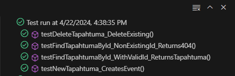

# Ticketguru-lipunmyyntijärjestelmän testidokumentti
Tämän dokumentti kuvaa Ticketguru-lipunmyyntijärjestelmän testausvaiheita. 
Dokumentista käy ilmi eri testausvaiheet, testikokonaisuuksien suunnitelmat, yksittäisten testien suunitelmat sekä testitulosten analyysit.

## Testeihin käytetyt ohjelmistot
Komponenttitesteihin käytetään Junitia, jolla tehdään back-endin testit. Integraatiotesteihin ja End-to-End-testeihin käytetään sekä Junitia ja  Robot Frameworkia.

#### 

Komponenttitestien tarkoitus on testata yhden yksittäisen komponentin toimintaa. Testeillä halutaan selvittää toimiiko komponentti tai komponentin osa kuten halutaan. Komponentin läpäistessä vaaditut testit, voidaan todeta, että ohjelman osa toimii. Tämän jälkeen voidaan siirtyä ohjelmoinnissa ja testauksessa seuraavaan vaiheeseen.

#### 

TapahtumaRestControllerTest.java tämä luokka sisältää yksikkötestejä TapahtumaRestControllerille, joka vastaa HTTP-pyyntöihin. Tapahtuma -entiteetteihin liittyen TicketGuru-sovelluksessa. Nämä testit kattavat perus CRUD (Create, Read, Update, Delete) toiminnot, varmistaen että tapahtumat voidaan noutaa, luoda ja poistaa onnistuneesti.
 
Testit on kirjoitettu käyttäen JUnit 5 -kehystä ja Mockitoa riippuvuuksien simuloimiseen. MockMvc:tä käytetään HTTP-pyyntöjen simuloimiseen ja vastausten varmistamiseen ilman, että koko Spring-sovellus käynnistyy.

#### Tapahtumat-luokan testisuunnitelmat

> Testin id | Kuvaus | Lähtötilanne | Toimenpiteet | Oletettu lopputulos 
> --------- | ------ | ------------ | ------------ | ------------------
> 1 | Hae kaikki tapahtumat | Listalla on kolme tapahtumaa | Testi hakee listan. Listalla on  oltava yli 0 tapahtumaa. | Testi löytää listan, jossa on yli 0 tapahtumaa.
> 2 | Hae yksi tietty tapahtuma | Listalla on kolme tapahtumaa | Testi etsii listalta tapahtuman, jonka id on 1. Tapahtuman nimen on oltava "Rock Festivaali" | Testi löytää ko. tapahtuman
> 3 | Lisää tapahtuma | Listalla on kolme tapahtumaa | Listaan lisätään yksi tapahtuma. | Lista sisältää 4 tapahtumaa.
> 4 | Muokkaa tapahtumaa | Listalla on yksi "Rock Festivaali" -niminen tapahtuma. | Testi muokkaa tapahtuman nimeksi "Humppafest". | Testi löytää listalta "Humppafest"-nimisen tapahtuman.

#### Komponenttitestien tulokset

#### TapahtumaRestController-luokan testisuunnitelmat

> Testin id | Kuvaus | Lähtötilanne | Toimenpiteet | Oletettu lopputulos 
> --------- | ------ | ------------ | ------------ | ------------------
> 1 | Hae yksi tapahtuma id:n perusteella | Tietokannassa on tapahtuma ID:llä 1 | Lähetä GET-pyyntö /tapahtumat/1 | Palauta tapahtuma JSON-muodossa
> 2 | Hae yksi tapahtuma, id ei löydy | Tietokannassa ei ole tapahtumaa ID:llä 1 | Lähetä GET-pyyntö /tapahtumat/1 | Palauta statuskoodi 404 (Not Found)
> 3 | Lisää uusi tapahtuma | Tietokannassa ei ole tapahtumaa ID:llä 1 | Lähetä POST-pyyntö /tapahtumat | Palauta statuskoodi 201 (Created)
> 4 | Poista tapahtuma | Tietokannassa on tapahtuma ID:llä 1 | Lähetä DELETE-pyyntö /tapahtumat/1 | Palauta statuskoodi 204 (No Content)

#### Integraatiotestien tulokset

#### End-to-End -testi

End-to-End-testi suoritetaan muista testeistä poiketen Robot Frameworkilla. Testillä halutaan selvittää, miten sovellus reagoi samanaikaiseen käyttöön.
Testissä avataan kahteen eri ikkunaan Ticketgurun Client-sovellus. Toisessa ikkunassa edetään ohjelmassa eteenpäin, kun taas toisessa ikkunassa halutaan pysyä etusivulla. Testillä halutaan selvittää, että miten ohjelma reagoi kahden käyttäjän samanaikaiseen toimintaan.

Testissä ensimmäisessä selaimessa kirjaudutaan sisään ja avataan lipunmyyntitoiminto. Tämän aikana toisessa ikkunassa ei pitäisi tapahtua mitään.

